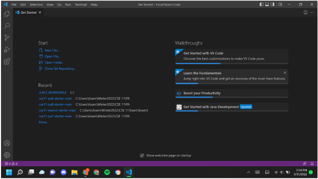
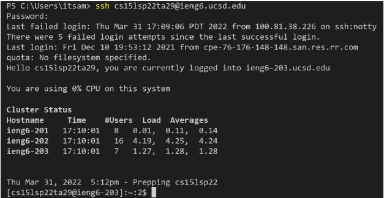
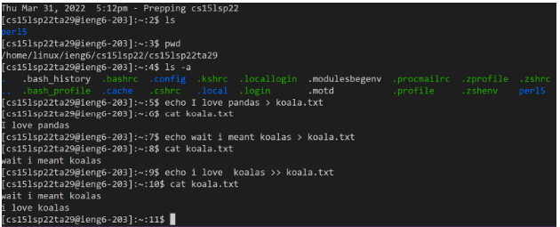
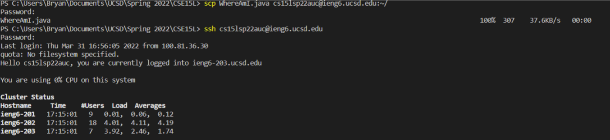
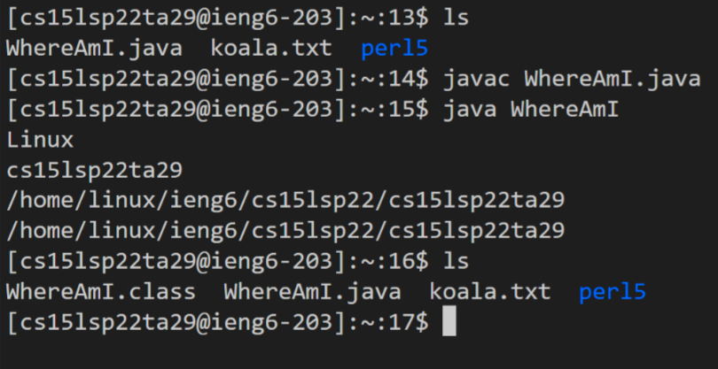
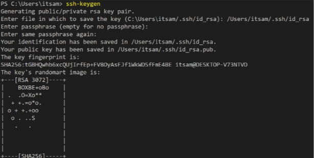
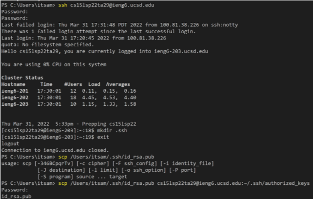
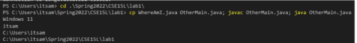
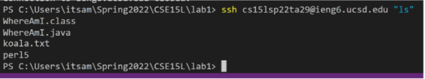
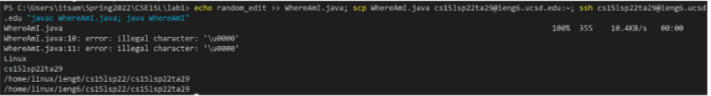

#CSE-15L-LAB-REPORT1-week2 -- Aman Kar

##4/10/2022

Topic: Remote Access

1. In order to set up course-specific account, the student must first have installed Visual Studio Code onto their computer.
If they had done this correctly, the following image should appear on their screen when they open Visual Studio Code. 

---

2. Once VS Code has been installed, now the student can try connecting to the ieng6
servers. The command to run would be 'ssh cs15lsp22**zz**@ieng6.ucsd.edu' where 
'zz' is the student's personal tag in their login. After typing in their password
they should be connected to the server. 

--- 

3. At this point of the tutorial, the student may consider practicing some commands
to run in the terminal. In the example seen below, the commands run were 'ls' to 
check the list of files, 'pwd' to check current working directory, and a combination of 'echo' and 'cat' to create and append to files by experimenting with '>' and '>>' in echoing to files. 

---

4. Now we are going to move files over SSH with the 'scp' command.  With the 'scp' command the student will move demo file 'WhereAmI.java' to his/her ieng6 server and compile / run program file there. The pictures below illustrate the syntax and correct behavior for the desire output. The final picture shows how the file is now in the ieng6 server repository. 

--- 

5. In order to become more effiecien with out work and logins, the student will create an SSH key to avoid the reptitive nature of typing the password. By creating a public and private key pair and having the public file on the server and the private file on the client, 'ssh' can now use those files to login instead of retyping your password. The following pictures illustrate the process and syntax of 'ssh-keygen.'

--- 

6. Remote access can become even more optimized with the use of quotes to run commands in the remote server when calling 'ssh'. Also, semi-colons allow for multiple commands to be called on the same line. Examples of these optimizations are seen in the pictures below when trying to optimize making a local edit to the 'WhereAmI.java' file. 

