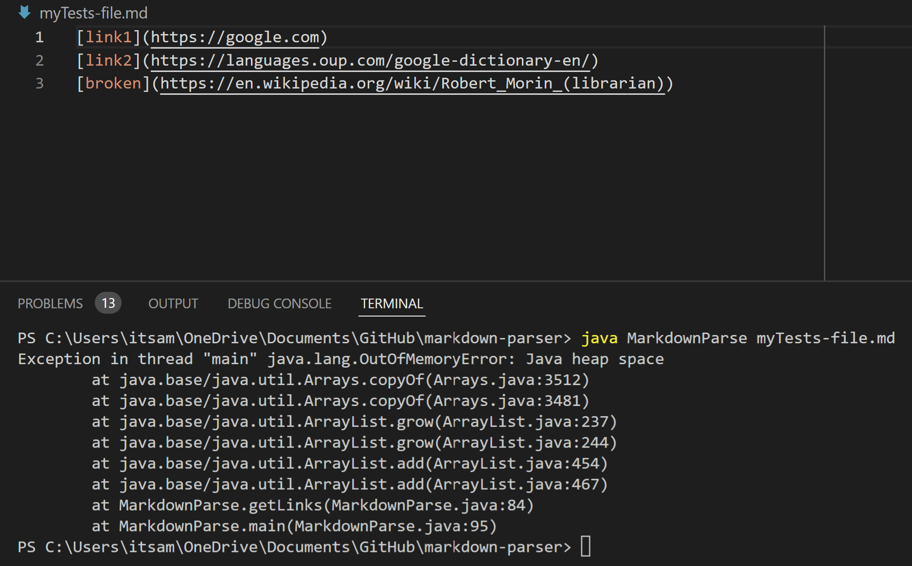
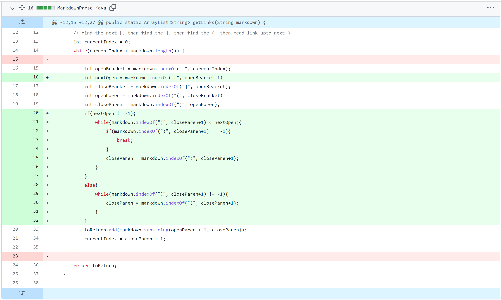
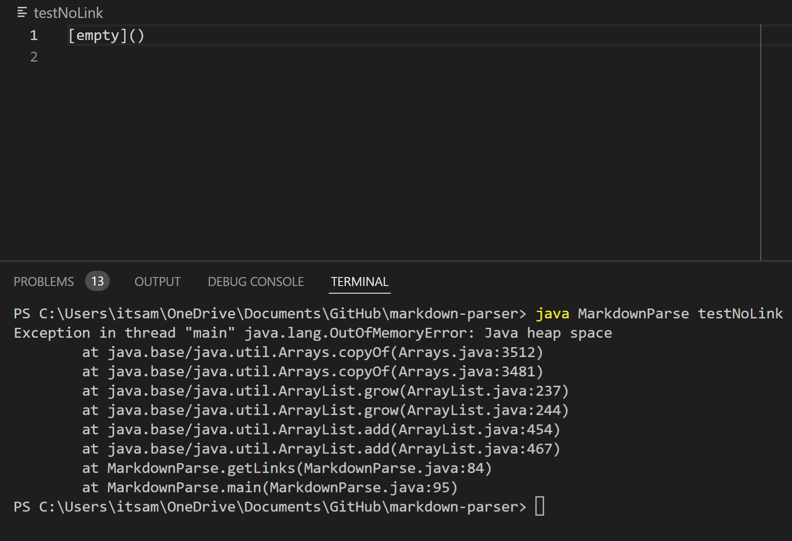
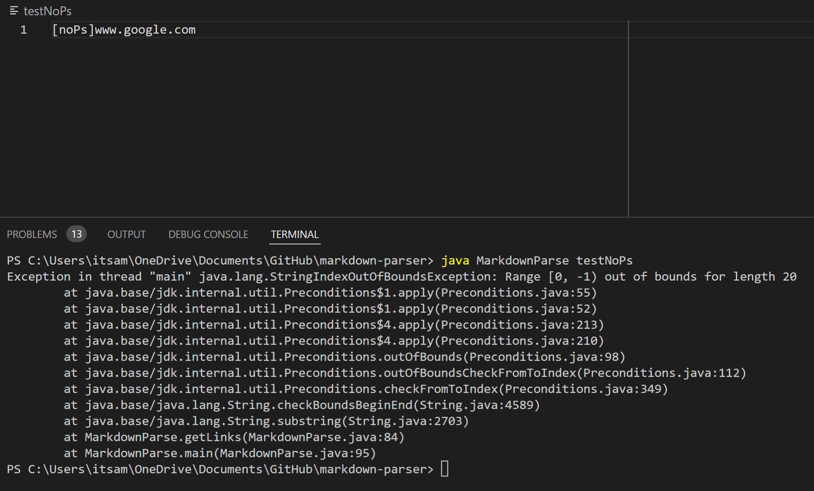
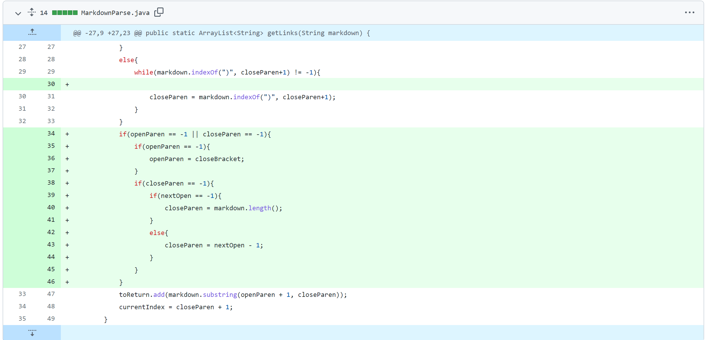
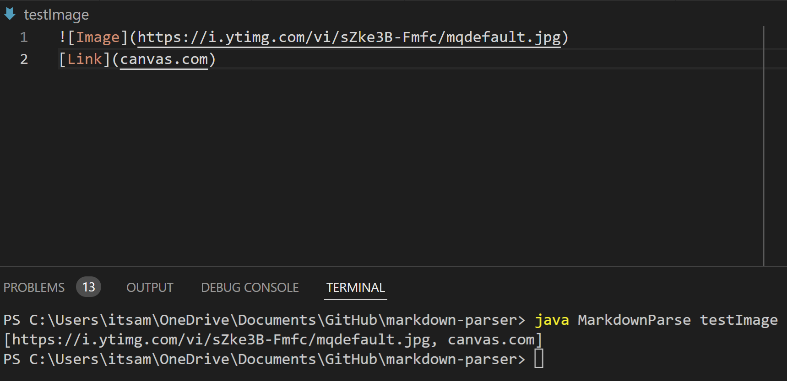
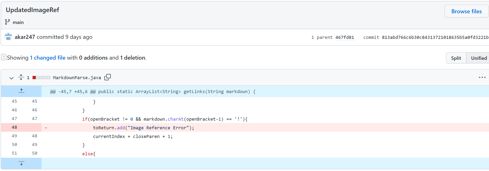

# CSE-15L Lab Report 2 week 4 -- Aman Kar

## 4/10/2022

[Home Page](index.md)

### Topic: Lab 3 Code Changes
 

#### 1. Code Change: Parenthese within link / url 

 

 

In this image, you can see the symptom that is caused by this file. In this case, the entire link is not being outputted. Instead, the original code for `MarkdownParse`, is forced into a forever while loop due to the extra parentheses. The occurrence of this error is the symptom. This symptom highlights the bug that this code has: it does not account for extra parentheses within a url. 

 

 

In this code change, I have a series of `if-statements` to check for the presence of parentheses within the url itself. I have the program ignore any occurence of parentheses (opening or closing) until the end of a line or the next open bracket. Links such as reddit links, that contain parentheses within the url will now work in this parser. The file that caused this error can be found [here.](myTests-file.md) A link to this git commit is [here.](https://github.com/akar247/markdown-parser/commit/80fa1d296f30346d34786a24e3411109bc7d8fc5)

  

#### 2. Code Change: Link w/o parentheses 
(assume links are until end of line or until next `[`)

 

 

In this image you can see that the code outputs both links in the file. Even no error is thrown, the presence of the first link in the output is actually a symptom because this link parser should not return any image references in the output. This shows us the bug in the code where it includes imnages in the output. 

 

 

In this case, I was able to solve these bugs with a series of `if-statements` to define the link as the characters after a close bracket to the end of a line(or to the next open bracket if multiple links on same line). This also worked with files that had an empty parentheses (no link). The file that caused this error had [no links](testNoLink) or [no parentheses](testNoPs). A link to this git commit is [here.](https://github.com/akar247/markdown-parser/commit/00d359f25e645b8a54eae1fa1ba5315aee65672e)

  

#### 3. Code Change: File contains image references 

 

 

In these images, you can see how the symptoms are either a heap space error (signifying a forever while loop) or an index out of bounds error. These errors points to bug within the code. The heap space error is caused by the empty link. The file looks for a url between the parentheses but, when it is not found, is thrown into a forever loop. For the file without parentheses, there is an index out of bounds exception which highlights the bug that the code does not know what to do when the file's index for a parentheses does not exist (i.e. -1). 

 

 

In this case, I was able to have the program ignore image references and only return urls from link references. Knowing that the only difference in syntax between the two was that image references had an `!` before the first open bracket, I was able to have the program skip to the next link whenever the line was an image reference instead of a link. The file that caused this error can be found [here.](testImage) A link to this git commit is [here.](https://github.com/akar247/markdown-parser/commit/813abd766c6b30c84313721018635b5a0fd3221b)

  
