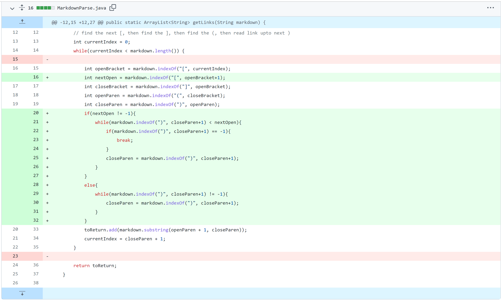
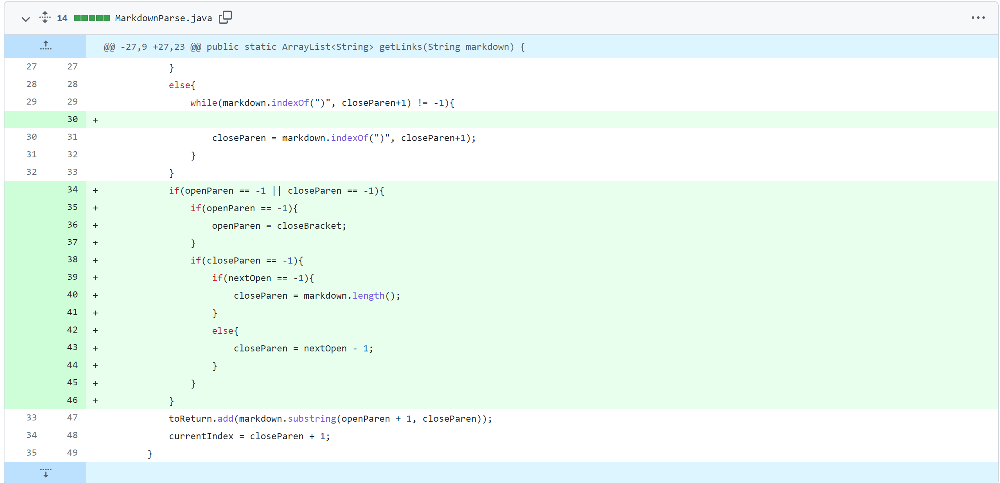
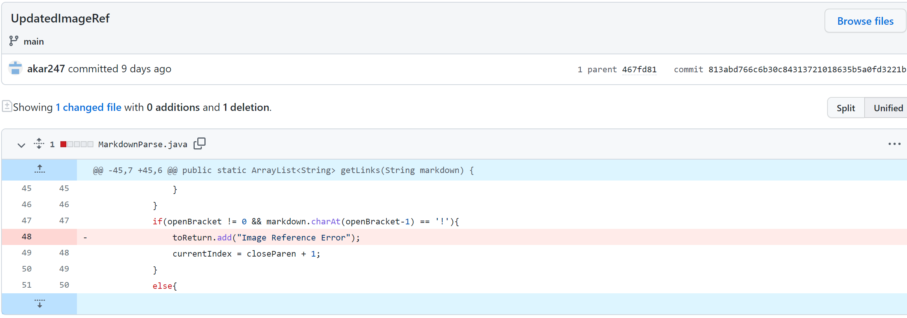

# CSE-15L Lab Report 2 week 4 -- Aman Kar

## 4/10/2022

[Home Page](index.md)

### Topic: Lab 3 Code Changes
 

#### 1. Code Change: Parenthese within link / url 

 

In this code change, I have a series of `if-statements` to check for the presence of parentheses within the url itself. I have the program ignore any occurence of parentheses (opening or closing) until the end of a line or the next open bracket. Links such as reddit links, that contain parentheses within the url will now work in this parser. The file that caused this error can be found [here.](myTests-file.md) A link to this git commit is [here.](https://github.com/akar247/markdown-parser/commit/80fa1d296f30346d34786a24e3411109bc7d8fc5)

  

#### 2. Code Change: Link w/o parentheses 
(assume links are until end of line or until next `[`)

 

In this case, I was able to solve it with a series of `if-statements` to define the link as the characters after a close bracket to the end of a line(or to the next open bracket if multiple links on same line). This also worked with files that had an empty parentheses (no link). The file that caused this error had [no links](testNoLink) or [no parentheses](testNoPs). A link to this git commit is [here.](https://github.com/akar247/markdown-parser/commit/00d359f25e645b8a54eae1fa1ba5315aee65672e)

  

#### 3. Code Change: File contains image references 

 

In this case, I was able to have the program ignore image references and only return urls from link references. Knowing that the only difference in syntax between the two was that image references had an `!` before the first open bracket, I was able to have the program skip to the next link whenever the line was an image reference instead of a link. The file that caused this error can be found [here.](testImage) A link to this git commit is [here.](https://github.com/akar247/markdown-parser/commit/813abd766c6b30c84313721018635b5a0fd3221b)

  
