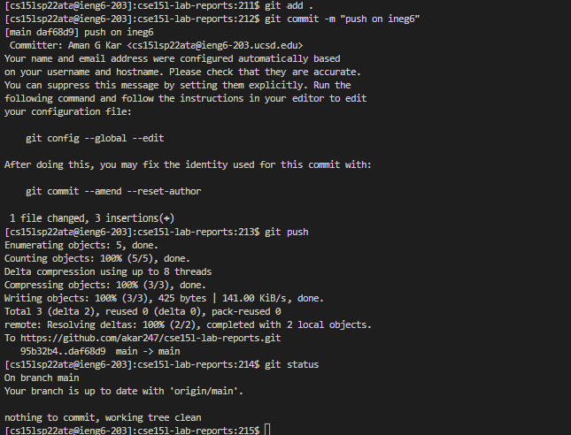
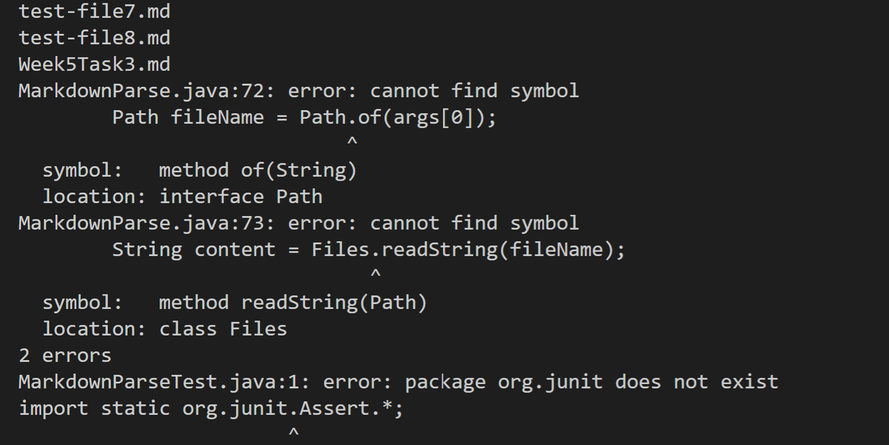

# CSE-15L-LAB-REPORT3-week6 -- Aman Kar

## &emsp; 5/8/2022

&emsp; &nbsp; [Home Page](index.md)

 

## __Topic: All Group Choice Options (1-3)__

 

## 1. Streamlining ssh Configuration
 

### &emsp; __A. Edit and config file, edited with VS Code__

 

 

The pictures above illustrates hwo to find the config file in the hidden ssh directory as well as the edit to make on the config file. For the `User` portion, make use of the [UCSD Account lookup](https://sdacs.ucsd.edu/cgi-bin/alloc-query) to find your user specific username.

 
 

### &emsp; __B. Logging with `ssh` command__

 

Utilizing the command `ssh ieng6`, the terminal automatically my key to log in with the associated username in the config file. As seen in the picture, with that command, the terminal logged me into the `ieng6` server. 

 

### &emsp; __C. `scp` command to copy files__

 

As seen in the image above, utilizing the comand `scp <file> cs15lsp22@ieng6.ucsd.edu:~/` I was able to copy a file from my local server to the ieng6 server. With the `ls` command, I can see the file in my ieng6 server. 

 
 

## 2. Setup Github Access from ieng6

 

### &emsp; __A. Public key on Github Server__

 
As seen in the above picture, the SSH key is stored on my personal account of the the online Github server. 

 

### &emsp; __B. Private key on user account__

 
As seen in the picture above, the id_rsa private key is stored in my .ssh file. Obviously I cannot show the contents of the file since that would allow anyone to login to my account. I also included an image of creating the key on my user account on ieng6 server. This allows me to use push and commit on the ieng6 server.

 

### &emsp; __C. Running Git `commit` & `push`__

 

To test running `commit` and `push` git commands on the ieng6 server, I will be using the addition of this text as the change to commit and push to the GitHub server. As seen in the picture above, the commands `add` , `commit`, and `push` worked correctly. This can be seen in the change of `git status` before and after pushing the changes. More evidence of this push is the link to the [commit](https://github.com/akar247/cse15l-lab-reports/commit/daf68d948e68d463a2bea4463ab38d5d868e41ed).

 
 

## 3. Copying with `scp -r`
 

### &emsp; __A. Copying whole markdown-parse directory__

 

Utilizing the `scp -r` command and the dedicated location of a `markdown-parse` folder on my ieng6 account, I was able to copy the entirety of the markdown-parse directory from my local server account (my computer) to my user account on the ieng6 server. 

 

### &emsp; __B. Running Tests on ieng6__

 

As seen in the picture above, after I had copied the markdown-parse directory with `scp -r`, I am not only able to find all the files and the entire directory on my ieng6 account, but also was able to run tests on the file through the server. 

 

### &emsp; __C. Combining Steps `scp` with `ssh`__

 

With the command seen in the picture above, I was able to create a oneline command that recursively copied an entire directory to a remote server, login to the remote server, go to the directory with the java files, and run the java test files. The quotation marks designate what commands were run on the remote server. The second pic shows the files actually being run, however, as seen in the terminal of that picture, there is an error occurring where the compiler is not able to recognize certain functions / syntax. 