# CSE-15L-LAB-REPORT4-week8 -- Aman Kar

## &emsp; 5/22/2022

&emsp; &nbsp; [Home Page](index.md)

 

## __Topic: MarkDown-Parse Testing (Mine and Reviewed)__

 
 
 ---
  

_My MarkdownParse Repo:_ [here](https://github.com/akar247/markdown-parser)

 

_Reviewed MarkdownParse Repo:_ [here](https://github.com/Aaron3963/MarkdownParser)

 

---
 

## __Snippet 1__

 

#### &emsp; _File Contents:_
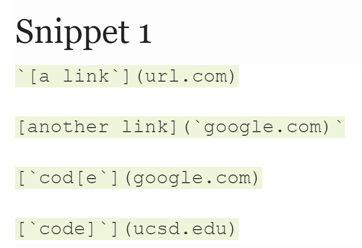

 
&emsp; Expected: 

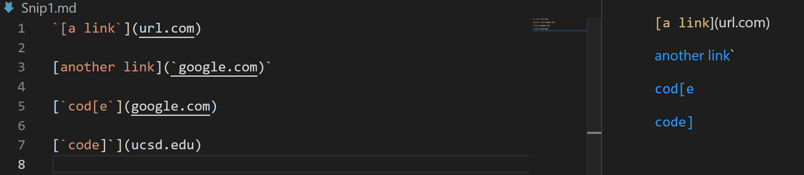

  

As seen in the "Expected" picture above, the links the MD parse java file should recognize are three links: google.com, google.com, and ucsd.edu. "url.com" should not be recognized as a link due to the placement of the apostrophe marks around the `[`. This means the returned output of the MD parse file should be: `["google.com", "google.com", "ucsd.edu"]`.

 
&emsp; Test Method: 

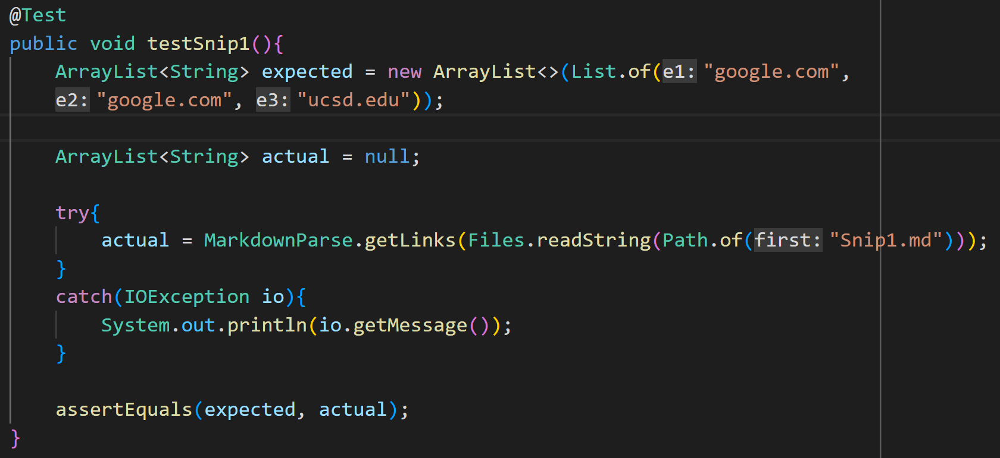

 

The picture above is the tester method for the Snippet 1 file. As seen for the `expected` variable, it is set to the expected output described above. 

 

&emsp; My Test Output:
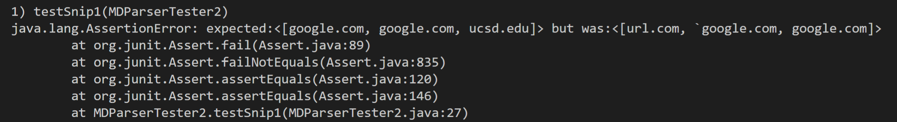

 

As seen in the error message above, my code does not consider the effects of apostrophes and quotation marks on the syntax of links, thus it considers `url.com` a link when the markdown syntax does not. 

 

&emsp; Review Test Output:
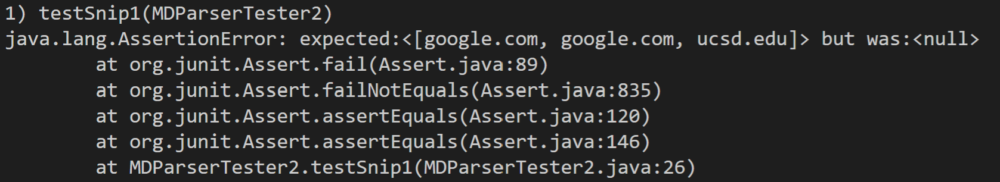

 

As seen in the error message above, the repo I reviewed had code that did not know how to handle a file structured in this way and could only output null. 

 

__Q1.__  
&emsp; I think to fix the effect of quotation and apostrophe marks on the syntax of .md files it would take more than 10 lines of code. Essentially what I would have to accomplish is for my code to check if every bracket and / or parenthesis are in between two paired apostrophe marks. I would probably also have to implement a stack or another check of some sort to remember whether or not one apostrophe has been paired yet and the quote has ended. 

 

--- 

 

## __Snippet 2__

 

#### &emsp; _File Contents:_
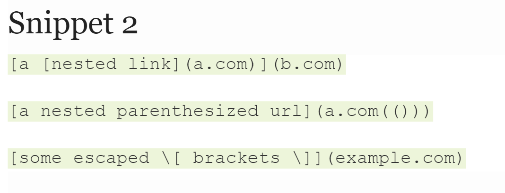

 
&emsp; Expected: 

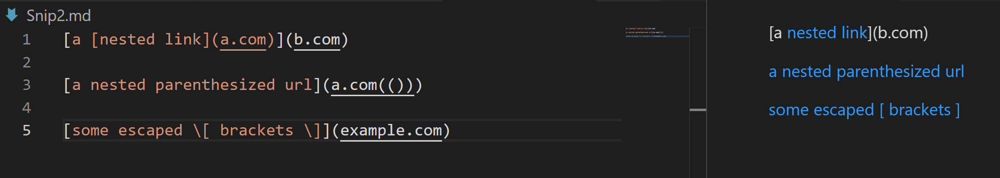

  

As seen in the "Expected" picture above, the links the MD parse java file should recognize are three links: a.com, a.com(()), and example.com. "b.com" should not be recognized as a link due to the placement of the nested link of that cancelled its syntax. This means the returned output of the MD parse file should be: `["a.com", "a.com()", "example.com"]`. This file tests for the nested links, extra parentheses, and when there escape brackets that should not be considered as part of the syntax for creating a link. 

 
&emsp; Test Method: 

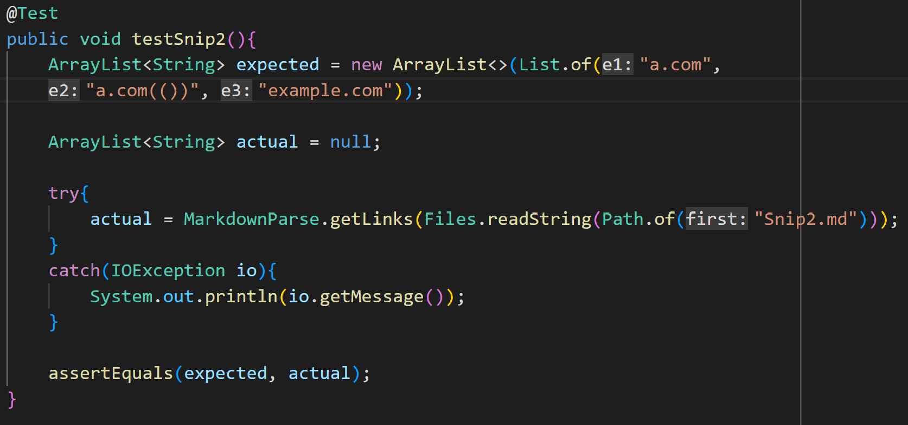

 

The picture above is the tester method for the Snippet 2 file. As seen for the `expected` variable, it is set to the expected output described above. 

 

&emsp; My Test Output:
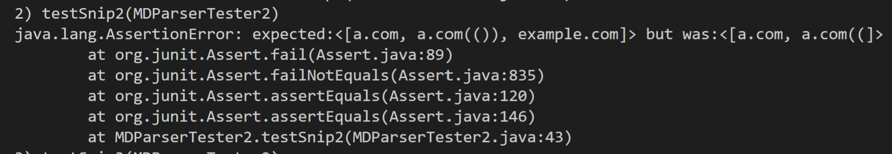

 

As seen in the error message above, my code does not know how to handle the extra parentheses within the link which made it return early and did not even get to read the `example.com` link. 

 

&emsp; Review Test Output:
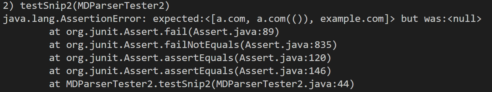

 

As seen in the error message above, the repo I reviewed had code that did not know how to handle a file structured in this way and could only output null. 

 

__Q2.__  
&emsp; I think I would be able to fix the extra parentheses within a link error within 10 lines of code. I would just have to make the program ignore any paretheses that come before the actual ending parentheses by setting the last parentheses to the parentheses that appears before the next open bracket or before the end of the file. However, I am sure if the program read to `example.com` link, it would have had another error because I have not implemented my program to ignore the character after a `\`, but I do think I could also implement this fix within 10 lines of code by just having the program skip the next character when reading each line. 

 

---

 

## __Snippet 3__

 

#### &emsp; _File Contents:_
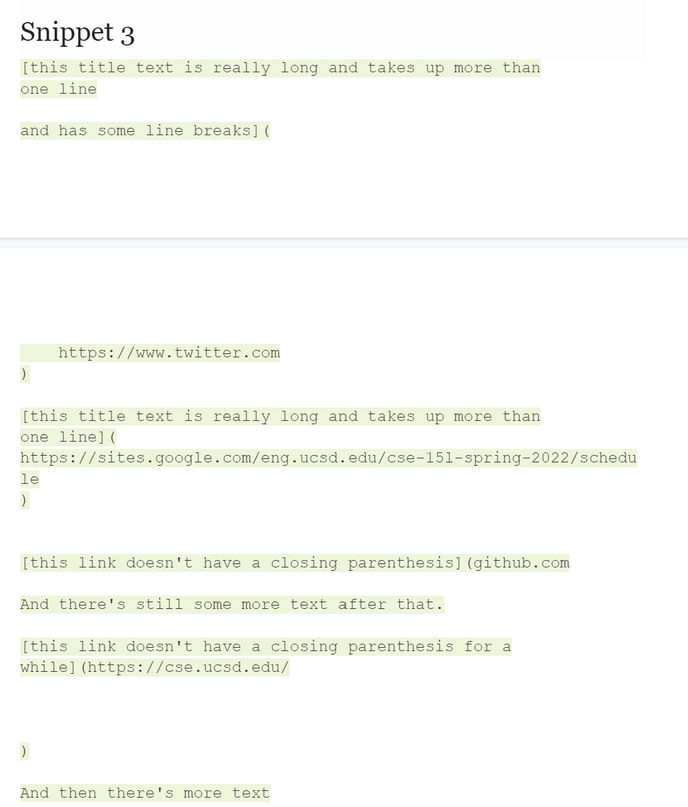

 
&emsp; Expected: 

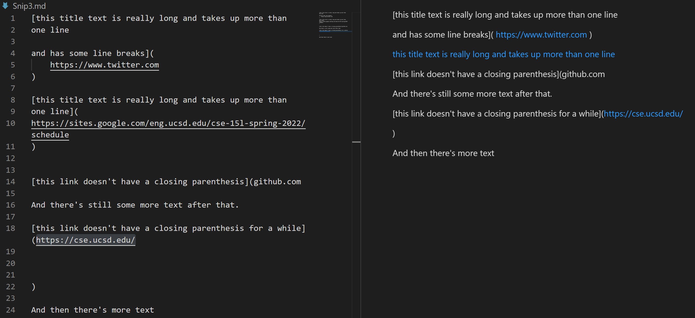

  

As seen in the "Expected" picture above, the MD parse java file should recognize three links. This test file attempts to test if the parse file is able to handle links that have text that go over one line or if the link is very long. It also checks if you program knows how to handle a missing parentheses or when the parentheses is written a couple lines away. The expected returned output would be `["https://twitter.com", "https://sites.google.com/eng.ucsd.edu/cse-15l-spring-2022/schedule", "https://cse.ucsd.edu/"]`.

 
&emsp; Test Method: 

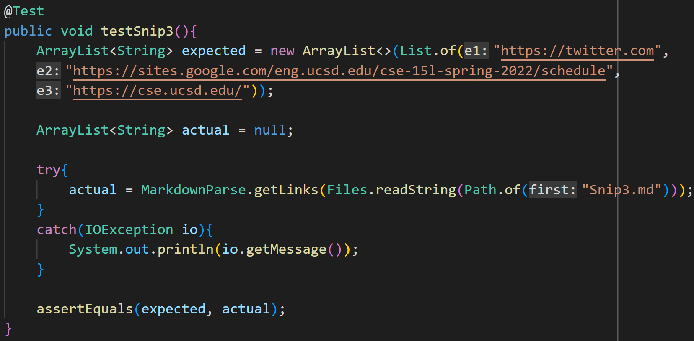

 

The picture above is the tester method for the Snippet 3 file. As seen for the `expected` variable, it is set to the expected output described above. 

 

&emsp; My Test Output:
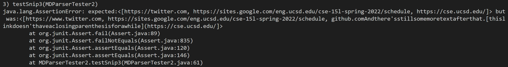

 

As seen in the error message above, my code does not know how to handle missing parentheses and ruins the rest of the link recognition. However, my code does consider the scenario when there is space between the end of a link and the parenthesis by removing any whitespace in a link. 

 

&emsp; Review Test Output:

 

As seen in the error message above, the repo I reviewed had code that did not know how to handle a file structured in this way and could only output null. 

 

__Q3.__  
&emsp; In order to fix the missing parentheses error in my code, it should be possible to have the `closing parentheses` variable to point to the index right before the next open bracket (or end of file if last link) within 10 lines of code. With my removal of all the whitespace, it doesn't matter if there is a lot of space in between the open parenthesis and next open bracket because it will be removed. 