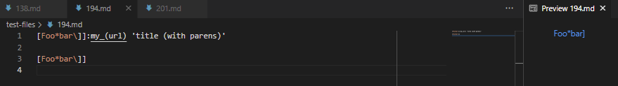
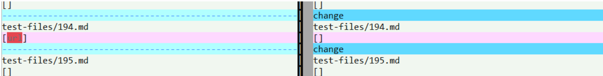
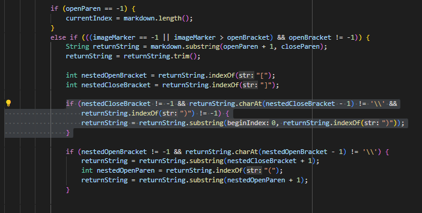
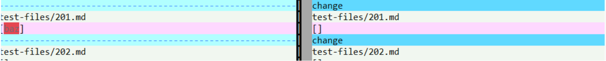
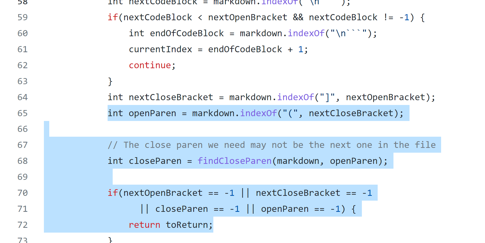

# CSE-15L-LAB-REPORT5-week10 -- Aman Kar

## &emsp; 6/5/2022

&emsp; &nbsp; [Home Page](index.md)

 

## __Topic: Comparing MDParse Implementations__

 

### 1. How did I find the differences?

* I was able to find the differences between the outputs of my MarkDown Parse implementation and the implementation given for lab 9 using the vimdiff command. This command outlines all file outputs for each implentation and highlights the differences that may have occurred between the two implementations. 

 
 

### 2. Test Files:
* For this lab report I will be comparing the ouputs of the following files:  

   - [TestFile 194](https://github.com/nidhidhamnani/markdown-parser/blob/main/test-files/194.md)  

   - [TestFile 201](https://github.com/nidhidhamnani/markdown-parser/blob/main/test-files/201.md)  

 
 

### 3A. TestFile 194
 

 

 

As seen in the images above, the expected output for the testfile 194.md would be a one link output of [title (with parens)]. However, both my implementation and the lab 9 implementation of Markdown Parse have incorrect output based off the preview of file 194 in the first image. My implementation output a link "url" and the lab 9 implementation output an empty list. 

 
My implementation has the bug of always looking for the text within parentheses following an ending bracket to set as a link, however there was no parentheses immediately following the ending bracket. This implementation is incorrect because md files can also have links that are created like how it is with file 194 where it is simply the text in quotes following a space after my_(url). The quotes in this case indicate the entirety of the link rather than parentheses to do such marking. 

 

The Error:
 

 

This section of code is where the bug occurs since my code does not actually look for the ":" that allows for this type of behavior in the md file to look for the text following the "coloned" information (in this case "my_(url)"). 

### 3B. TestFile 201
 

 

 

As seen in the images above, the expected output for the testfile 201.md would be an empty link output []. My implementation, on the right, correctly outputs an empty list because there are no valid md links in this file. The lab 9 implementation, however, outputs a list with 'baz'. 

 
Lab 9's implementation of Markdown Parse has the code always looking for the text within parentheses, no matter where the parenthese are. That is why their code output [baz], since there was a pair of parentheses (as seen in the first image) that followed the bracketed text. However, since md syntax does not follow this format (i.e. parentheses must follow the ending bracket), their was no link found.  

 

The Error:
 

 

This section of code is where the bug occurs. Here,  you can see how the indexes of openParen and closeParen are assigned, however, there is no check on if the parentheses was immediately following the ending bracket. There must be some form of a check like this otherwise files that have random text in parentheses will be considered links if they ever come after an ending bracket. However, these texts should not be considered links because, as seen in test file 201, they are not links according to md syntax. 

